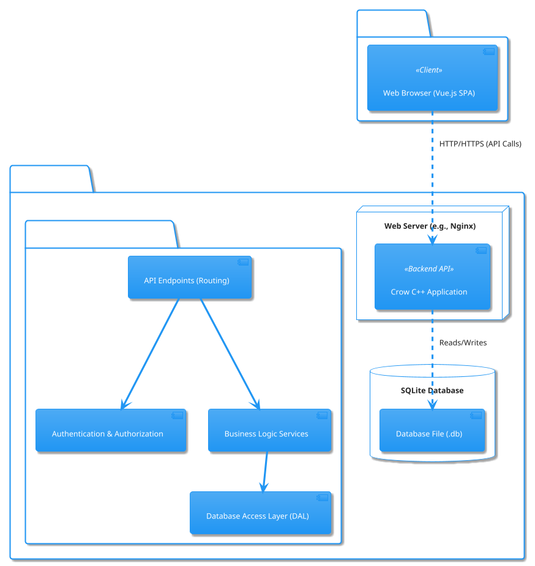
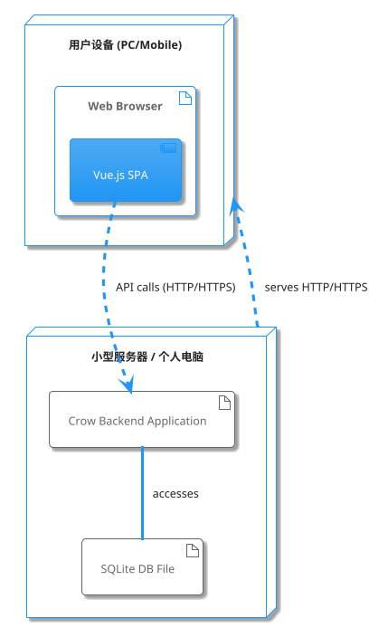
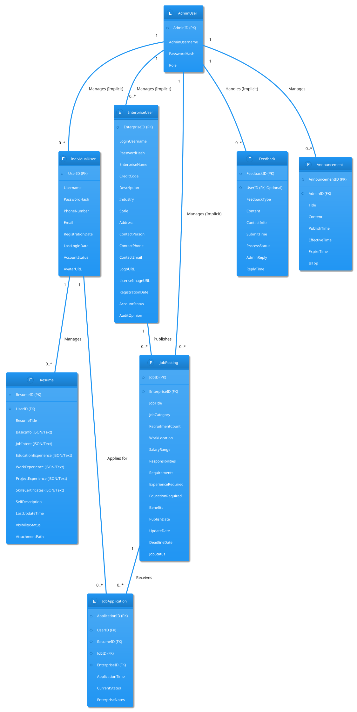
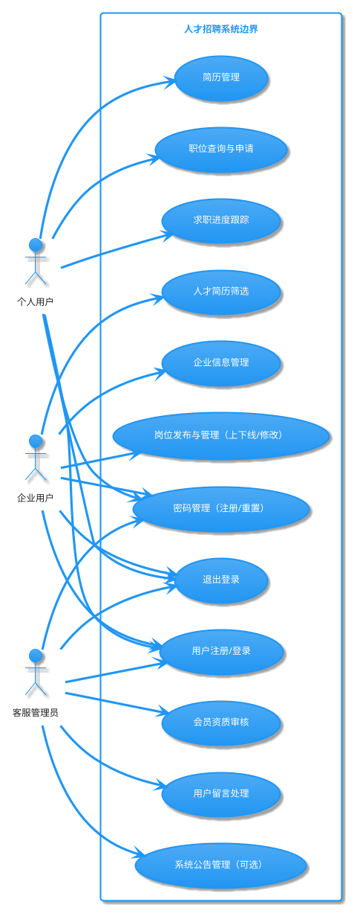

# 系统设计文档 (SDD)

**项目名称：** 无形大手 人才招聘系统
**版本：** 1.0
**日期：** 2025年5月12日
**编制：** 住在村里真不错

---

# **目录**

1.  引言
    1.1 目的
    1.2 项目范围回顾
    1.3 定义、首字母缩写和缩略语
    1.4 参考文献
    1.5 文档概述
2.  系统概述
    2.1 系统目标
    2.2 系统功能摘要
    2.3 技术栈
3.  系统架构
    3.1 架构风格
    3.2 高层架构图 (组件图)
    3.3 部署图
    3.4 技术选型理由
4.  数据设计
    4.1 数据模型 (概念ER图 - PlantUML)
    4.2 数据库表设计 (主要表结构描述)
    4.3 数据持久化与备份
5.  组件设计
    5.1 前端组件 (Vue.js)
        5.1.1 个人用户界面组件
        5.1.2 企业用户界面组件
        5.1.3 管理员界面组件
        5.1.4 通用/共享组件
    5.2 后端组件 (C++/Crow)
        5.2.1 API路由与控制器
        5.2.2 用户认证与授权服务
        5.2.3 个人用户服务模块
        5.2.4 企业用户服务模块
        5.2.5 管理员服务模块
        5.2.6 数据库交互模块
    5.3 模块交互 (用例图 - PlantUML)
6.  接口设计
    6.1 外部接口
        6.1.1 用户界面 (UI)
        6.1.2 API接口 (RESTful)
    6.2 内部接口
7.  安全性设计
    7.1 用户认证
    7.2 数据传输安全
    7.3 数据存储安全
    7.4 防范常见Web攻击
8.  性能与可扩展性设计
    8.1 性能考虑
    8.2 SQLite并发与优化
    8.3 可扩展性考虑
9.  部署与维护
    9.1 部署环境
    9.2 部署步骤概述
    9.3 日志与监控
    9.4 系统维护
    
---

# 1. 引言

## 1.1 目的
本文档是“无形大手 人才招聘系统”的系统设计说明书 (SDD)。它基于已批准的软件需求规格说明书 (SRS V1.0)，旨在详细描述系统的架构、模块划分、数据结构、接口设计以及关键技术实现方案。本文档将作为开发团队进行系统详细设计、编码实现和集成测试的主要技术依据。

## 1.2 项目范围回顾
本项目旨在为某县政府开发一个本地化的人才招聘系统，服务于个人求职者、本地企业和系统管理员。核心功能包括个人用户的简历管理与职位申请，企业用户的岗位发布与人才筛选，以及管理员的用户审核与内容管理。系统将部署在小型服务器或个人电脑上，用户量级预估为千至万级。

## 1.3 定义、首字母缩写和缩略语
(同SRS 1.3，此处为确保独立性可选择性复制关键术语)
*   SDD: System Design Document (系统设计文档)
*   SRS: Software Requirement Specification (软件需求规格说明书)
*   API: Application Programming Interface (应用程序编程接口)
*   REST: Representational State Transfer
*   JSON: JavaScript Object Notation
*   CRUD: Create, Read, Update, Delete
*   JWT: JSON Web Token
*   ORM: Object-Relational Mapping (对象关系映射) - *注：本项目可能不使用完整ORM，而是直接SQL或轻量级包装器*

## 1.4 参考文献
*   [无形大手 人才招聘系统 - 软件需求规格说明书 (SRS) V1.0](SRS的链接或文件名)
*   [无形大手 人才招聘系统 - 可行性分析报告](https://sirbwnmp2v.feishu.cn/docx/IcDRd4dSno2dmHxOcEEc3EOJnth)
*   Crow C++ Microframework Documentation ([https://crowcpp.org/](https://crowcpp.org/))
*   Vue.js Documentation ([https://vuejs.org/](https://vuejs.org/))
*   SQLite Documentation ([https://www.sqlite.org/](https://www.sqlite.org/))

## 1.5 文档概述
本文档首先概述系统目标和技术栈。随后，详细阐述系统架构，包括高层架构图和部署图。数据设计部分将展示概念数据模型和主要的数据库表结构。组件设计部分将细化前后端的主要模块及其职责。接口设计描述了系统对外的API和内部模块间的交互。最后，讨论了安全性、性能、部署和维护方面的设计考虑。

# 2. 系统概述

## 2.1 系统目标
(同SRS 2.1 产品愿景)
本系统致力于为特定区县打造一个本地化、易用、高效的人才供需对接平台。通过有效整合本地中小型企业、个体商户及各类单位的招聘信息，解决其在大型招聘网站上信息淹没、难以被本地求职者发现以及操作复杂等问题。同时，为本地区县的待就业人员提供一个集中、可靠、便捷的本地就业信息渠道，促进本地人力资源的有效配置和地方经济发展。

## 2.2 系统功能摘要
系统主要包含三大模块：
*   **个人用户模块：** 注册登录、简历管理、职位查询与申请、求职管理、密码管理。
*   **企业用户模块：** 注册登录、企业信息管理、岗位发布与管理、人才查询、密码管理。
*   **客服管理人员模块：** 会员审核、留言管理、系统公告（可选）、密码管理。

## 2.3 技术栈
*   **前端：** Vue.js (响应式Web界面)
*   **后端：** C++17 (或更高) 与 Crow 微框架 (RESTful API服务)
*   **数据库：** SQLite 3.x & SQLiteCpp (轻量级文件数据库)
*   **操作系统：** Linux (推荐) 或 Windows
*   **Web服务器：** Crow内建服务器 (开发/小型部署)，可考虑Nginx/Apache反向代理 (生产)

# 3. 系统架构

## 3.1 架构风格
本系统采用经典的三层/N层架构，结合前后端分离的设计模式。
*   **表现层 (Presentation Layer)：** 基于Vue.js构建的单页面应用 (SPA)，运行在用户浏览器中，负责用户界面的展示和用户交互。
*   **应用层/业务逻辑层 (Application/Business Logic Layer)：** 基于C++/Crow框架构建的后端API服务。负责处理HTTP请求，执行业务逻辑，数据验证，与数据访问层交互。
*   **数据访问层 (Data Access Layer)：** 使用SQLiteCpp封装对SQLite数据库的CRUD操作。后端服务通过此层与数据库通信。

这种架构有助于实现关注点分离，提高模块化程度，便于独立开发、测试和维护。

## 3.2 高层架构图



**图例说明:**
*   **Web Browser (Vue.js SPA):** 用户通过浏览器访问的前端应用程序。
*   **Web Server (e.g., Nginx):** 可选，用于反向代理、HTTPS终止、静态文件服务。Crow应用也可以直接对外服务。
*   **Crow C++ Application:** 后端核心应用，提供RESTful API。
    *   **API Endpoints (Routing):** 负责接收HTTP请求并将其路由到相应的处理程序。
    *   **Authentication & Authorization:** 处理用户登录验证和权限检查。
    *   **Business Logic Services:** 实现各项业务功能（如简历管理、职位发布等）。
    *   **Database Access Layer (DAL):** 封装数据库操作，与SQLite交互。
*   **SQLite Database File:** 存储系统所有持久化数据。

## 3.3 部署图



**图例说明:**
*   **用户设备:** 个人电脑或移动设备，运行Web浏览器。
*   **Vue.js SPA:** 前端应用，在浏览器中运行。
*   **小型服务器/个人电脑:** 部署后端应用和数据库的物理或虚拟机器。
*   **Crow Backend Application:** 后端C++可执行程序。
*   **SQLite DB File:** 数据库文件，与后端应用在同一台机器上。

## 3.4 技术选型理由
*   **Vue.js：** 成熟的前端框架，组件化开发，生态良好，上手相对容易，适合快速构建响应式SPA。
*   **C++/Crow：** Crow是一个轻量级的C++ Web微框架，性能较高，依赖少，适合构建小型、高效的API服务。
*   **SQLite：** 轻量级、无服务器、基于文件的数据库。配置简单，易于部署在小型服务器或个人电脑上，适合本项目用户量级和部署要求。
*   **前后端分离：** 提高开发效率，降低耦合，便于团队分工，前后端可独立迭代和部署。

# 4. 数据设计

## 4.1 数据模型 (概念ER图 - PlantUML)
基于SRS 4.1 数据描述，关键实体及其关系如下：



## 4.2 数据库表设计 (主要表结构描述)
以下是主要表的字段描述，具体数据类型将根据SQLite的特性选择 (TEXT, INTEGER, REAL, BLOB, NUMERIC)。

1.  **`IndividualUsers` 表 (个人用户)**
    *   `UserID` (INTEGER, PK, AUTOINCREMENT): 用户唯一标识
    *   `Username` (TEXT, UNIQUE, NOT NULL): 用户名
    *   `PasswordHash` (TEXT, NOT NULL): 加盐哈希后的密码
    *   `PhoneNumber` (TEXT, UNIQUE): 手机号
    *   `Email` (TEXT, UNIQUE): 电子邮箱
    *   `RegistrationDate` (TEXT, DATETIME DEFAULT CURRENT_TIMESTAMP): 注册时间
    *   `LastLoginDate` (TEXT, DATETIME): 最后登录时间
    *   `AccountStatus` (TEXT, NOT NULL, DEFAULT 'Active'): 账户状态 (e.g., 'Active', 'Disabled')
    *   `AvatarURL` (TEXT): 头像图片路径/URL

2.  **`Resumes` 表 (简历)**
    *   `ResumeID` (INTEGER, PK, AUTOINCREMENT): 简历唯一标识
    *   `UserID` (INTEGER, FK to `IndividualUsers`): 所属用户ID
    *   `ResumeTitle` (TEXT): 简历标题
    *   `BasicInfo` (TEXT, JSON): 基本信息 (姓名、性别、出生日期等)
    *   `JobIntent` (TEXT, JSON): 求职意向 (期望行业、职位、薪资等)
    *   `EducationExperience` (TEXT, JSON Array): 教育经历列表
    *   `WorkExperience` (TEXT, JSON Array): 工作经历列表
    *   `ProjectExperience` (TEXT, JSON Array): 项目经验列表
    *   `SkillsCertificates` (TEXT, JSON Array): 技能证书列表
    *   `SelfDescription` (TEXT): 自我评价
    *   `LastUpdateTime` (TEXT, DATETIME DEFAULT CURRENT_TIMESTAMP): 最后更新时间
    *   `VisibilityStatus` (TEXT, DEFAULT 'Private'): 公开状态 (e.g., 'PublicToAll', 'PublicToApplied', 'Private')
    *   `AttachmentPath` (TEXT): 附件简历路径 (可选)

3.  **`EnterpriseUsers` 表 (企业用户)**
    *   `EnterpriseID` (INTEGER, PK, AUTOINCREMENT): 企业唯一标识
    *   `LoginUsername` (TEXT, UNIQUE, NOT NULL): 企业登录用户名
    *   `PasswordHash` (TEXT, NOT NULL): 加盐哈希后的密码
    *   `EnterpriseName` (TEXT, NOT NULL): 企业全称
    *   `CreditCode` (TEXT, UNIQUE, NOT NULL): 统一社会信用代码
    *   `Description` (TEXT): 企业简介
    *   `Industry` (TEXT): 所属行业
    *   `Scale` (TEXT): 企业规模
    *   `Address` (TEXT): 企业地址
    *   `ContactPerson` (TEXT): 联系人姓名
    *   `ContactPhone` (TEXT): 联系人手机
    *   `ContactEmail` (TEXT): 联系人邮箱
    *   `LogoURL` (TEXT): 企业Logo路径/URL
    *   `LicenseImageURL` (TEXT, NOT NULL): 营业执照图片路径/URL (审核用)
    *   `RegistrationDate` (TEXT, DATETIME DEFAULT CURRENT_TIMESTAMP): 注册时间
    *   `AccountStatus` (TEXT, NOT NULL, DEFAULT 'PendingReview'): 账户状态 (e.g., 'PendingReview', 'Approved', 'Rejected', 'Disabled')
    *   `AuditOpinion` (TEXT): 审核意见 (管理员填写)

4.  **`JobPostings` 表 (招聘岗位)**
    *   `JobID` (INTEGER, PK, AUTOINCREMENT): 岗位唯一标识
    *   `EnterpriseID` (INTEGER, FK to `EnterpriseUsers`): 发布企业ID
    *   `JobTitle` (TEXT, NOT NULL): 岗位名称
    *   `JobCategory` (TEXT): 职位类别
    *   `RecruitmentCount` (INTEGER): 招聘人数
    *   `WorkLocation` (TEXT): 工作地点
    *   `SalaryRange` (TEXT): 薪资范围
    *   `Responsibilities` (TEXT, NOT NULL): 岗位职责
    *   `Requirements` (TEXT, NOT NULL): 任职要求
    *   `ExperienceRequired` (TEXT): 工作经验要求
    *   `EducationRequired` (TEXT): 学历要求
    *   `Benefits` (TEXT): 福利待遇
    *   `PublishDate` (TEXT, DATETIME DEFAULT CURRENT_TIMESTAMP): 发布时间
    *   `UpdateDate` (TEXT, DATETIME): 更新时间
    *   `DeadlineDate` (TEXT, DATETIME): 截止日期 (可选)
    *   `JobStatus` (TEXT, NOT NULL, DEFAULT 'Recruiting'): 岗位状态 (e.g., 'Recruiting', 'PendingReview', 'Offline', 'Filled')

5.  **`JobApplications` 表 (职位申请记录)**
    *   `ApplicationID` (INTEGER, PK, AUTOINCREMENT): 申请唯一标识
    *   `UserID` (INTEGER, FK to `IndividualUsers`): 申请人ID
    *   `ResumeID` (INTEGER, FK to `Resumes`): 投递简历ID
    *   `JobID` (INTEGER, FK to `JobPostings`): 申请职位ID
    *   `EnterpriseID` (INTEGER, FK to `EnterpriseUsers`): 职位所属企业ID
    *   `ApplicationTime` (TEXT, DATETIME DEFAULT CURRENT_TIMESTAMP): 申请时间
    *   `CurrentStatus` (TEXT, NOT NULL, DEFAULT 'Submitted'): 当前状态 (e.g., 'Submitted', 'ViewedByHR', 'InterviewInvited', 'Rejected', 'Hired')
    *   `EnterpriseNotes` (TEXT): 企业备注 (对内)

6.  **`AdminUsers` 表 (管理员用户)**
    *   `AdminID` (INTEGER, PK, AUTOINCREMENT): 管理员唯一标识
    *   `AdminUsername` (TEXT, UNIQUE, NOT NULL): 管理员用户名
    *   `PasswordHash` (TEXT, NOT NULL): 加盐哈希后的密码
    *   `Role` (TEXT, NOT NULL, DEFAULT 'Admin'): 角色 (为未来扩展，初期可固定)

7.  **`Feedbacks` 表 (系统留言/反馈)**
    *   `FeedbackID` (INTEGER, PK, AUTOINCREMENT): 留言ID
    *   `UserID` (INTEGER, FK to `IndividualUsers` or `EnterpriseUsers`, 可NULL): 提交用户ID (区分用户类型或合并用户表)
    *   `UserType` (TEXT, 可NULL): 'Individual' or 'Enterprise' if UserID is present
    *   `FeedbackType` (TEXT): 留言类型
    *   `Content` (TEXT, NOT NULL): 留言内容
    *   `ContactInfo` (TEXT): 用户留下的联系方式
    *   `SubmitTime` (TEXT, DATETIME DEFAULT CURRENT_TIMESTAMP): 提交时间
    *   `ProcessStatus` (TEXT, NOT NULL, DEFAULT 'Pending'): 处理状态 (e.g., 'Pending', 'Processing', 'Resolved')
    *   `AdminReply` (TEXT): 管理员回复内容
    *   `ReplyTime` (TEXT, DATETIME): 回复时间

8.  **`Announcements` 表 (系统公告)**
    *   `AnnouncementID` (INTEGER, PK, AUTOINCREMENT): 公告ID
    *   `AdminID` (INTEGER, FK to `AdminUsers`): 发布管理员ID
    *   `Title` (TEXT, NOT NULL): 公告标题
    *   `Content` (TEXT, NOT NULL): 公告内容 (可支持Markdown或简单HTML)
    *   `PublishTime` (TEXT, DATETIME DEFAULT CURRENT_TIMESTAMP): 发布时间
    *   `EffectiveTime` (TEXT, DATETIME): 生效时间
    *   `ExpireTime` (TEXT, DATETIME): 失效时间
    *   `IsTop` (INTEGER, DEFAULT 0): 是否置顶 (0或1)

**索引考虑：**
*   为所有外键创建索引。
*   为经常用于查询条件的字段创建索引 (如 `Username`, `Email`, `PhoneNumber` in `IndividualUsers`; `EnterpriseName`, `CreditCode` in `EnterpriseUsers`; `JobTitle`, `WorkLocation`, `JobCategory` in `JobPostings`)。
*   为日期时间字段创建索引，用于排序和范围查询。

## 4.3 数据持久化与备份
*   所有业务数据将持久化存储在SQLite数据库文件中。
*   **备份策略：**
    *   定期（例如每日）自动备份SQLite数据库文件 (`.db` 文件)。
    *   备份文件应存储在与主数据库文件不同的物理位置（如另一块磁盘、网络存储或云存储）。
    *   备份脚本应易于配置和执行。
*   **恢复策略：**
    *   制定清晰的数据恢复流程，包括如何从备份文件恢复数据库。
    *   定期进行恢复演练，确保备份的有效性和恢复流程的可行性。

# 5. 组件设计

## 5.1 前端组件 (Vue.js)

TODO:待实现

## 5.2 后端组件 (C++/Crow)
后端API服务按功能模块组织。具体类设计见[后端组件设计](后端组件设计.md)

### 5.2.1 API路由与控制器 (Crow `CROW_ROUTE` 宏)
*   定义RESTful API端点，将HTTP请求映射到相应的服务处理函数。
*   例如: `/api/v1/users/register`, `/api/v1/jobs`, `/api/v1/admin/enterprises/approve`。
*   负责解析请求参数、调用业务逻辑服务、构造并返回JSON响应。

### 5.2.2 用户认证与授权服务
*   **认证：**
    *   处理用户登录请求，验证用户名和密码。
    *   成功登录后，生成并返回JWT (JSON Web Token) 或基于Session的令牌。
    *   密码存储使用强哈希算法 (如Argon2, scrypt, bcrypt) 加盐。
*   **授权：**
    *   Crow中间件，用于验证请求头中的Token。
    *   解析Token，获取用户身份和角色。
    *   根据用户角色和请求的资源，判断是否有访问权限。

### 5.2.3 个人用户服务模块
*   `IndividualUserService`: 处理个人用户注册、登录、信息修改、密码重置等逻辑。
*   `ResumeService`: 处理简历的创建、读取、更新、删除 (CRUD) 操作。
*   `JobSearchService`: 处理职位搜索、筛选、详情查看逻辑。
*   `ApplicationService`: 处理职位申请提交、申请记录查询逻辑。

### 5.2.4 企业用户服务模块
*   `EnterpriseUserService`: 处理企业用户注册、登录、信息修改、密码重置等逻辑。
*   `JobPostingService`: 处理企业发布、修改、上下线、删除招聘岗位逻辑。
*   `TalentSearchService`: 处理企业查询、筛选投递到其岗位的简历逻辑，以及对申请的处理。

### 5.2.5 管理员服务模块
*   `AdminAuthService`: 处理管理员登录。
*   `UserManagementService`: 处理个人和企业用户的审核、状态管理。
*   `ContentManagementService`: 处理职位信息审核 (如果需要)、留言管理、公告管理。

### 5.2.6 数据库交互模块 (DAL)
*   封装所有对SQLite数据库的直接操作 (SQL语句执行)。
*   提供清晰的接口供业务逻辑服务调用，如 `findUserByUsername()`, `saveResume()`, `getJobsByCriteria()`。
*   使用SQLitCpp库封装的SQLite，方便编码
*   负责数据库连接管理 (虽然SQLite是文件数据库，也需要打开和关闭句柄)。
*   处理SQL注入防护 (使用参数化查询/预处理语句)。

## 5.3 模块交互 (用例图 - PlantUML)
此用例图展示主要参与者与系统的交互，对应SRS中的功能需求。



# 6. 接口设计

## 6.1 外部接口

### 6.1.1 用户界面 (UI)
*   如SRS 3.3.1所述，提供基于Web浏览器的图形用户界面。
*   采用响应式设计，适配PC和移动设备浏览器。
*   界面风格简洁、专业、易用。

### 6.1.2 API接口 (RESTful)
后端通过Crow框架提供RESTful API供前端Vue.js应用调用。数据交换格式为JSON。
所有API应有版本控制，例如 `/api/v1/...`。

**核心API端点:**

*   **认证 (Auth):**
    *   `POST /api/v1/auth/individual/register` (个人用户注册)
    *   `POST /api/v1/auth/individual/login` (个人用户登录)
    *   `POST /api/v1/auth/enterprise/register` (企业用户注册)
    *   `POST /api/v1/auth/enterprise/login` (企业用户登录)
    *   `POST /api/v1/auth/admin/login` (管理员登录)
    *   `POST /api/v1/auth/logout` (退出登录)
    *   `POST /api/v1/auth/forgot-password`
    *   `POST /api/v1/auth/reset-password`

*   **个人用户 (Users):**
    *   `GET /api/v1/users/me` (获取当前用户信息)
    *   `PUT /api/v1/users/me` (修改当前用户信息)
    *   `PUT /api/v1/users/me/password` (修改密码)
    *   `GET /api/v1/users/me/resumes` (获取我的简历列表)
    *   `POST /api/v1/users/me/resumes` (创建简历)
    *   `GET /api/v1/users/me/resumes/{resumeId}` (获取简历详情)
    *   `PUT /api/v1/users/me/resumes/{resumeId}` (修改简历)
    *   `DELETE /api/v1/users/me/resumes/{resumeId}` (删除简历)
    *   `GET /api/v1/users/me/applications` (获取我的求职申请)

*   **职位 (Jobs):**
    *   `GET /api/v1/jobs` (查询职位列表，支持分页和筛选参数)
    *   `GET /api/v1/jobs/{jobId}` (获取职位详情)
    *   `POST /api/v1/jobs/{jobId}/apply` (申请职位，需认证)

*   **企业用户 (Enterprises):**
    *   `GET /api/v1/enterprises/me` (获取当前企业信息)
    *   `PUT /api/v1/enterprises/me` (修改当前企业信息)
    *   `PUT /api/v1/enterprises/me/password` (修改密码)
    *   `GET /api/v1/enterprises/me/jobs` (获取企业发布的职位)
    *   `POST /api/v1/enterprises/me/jobs` (发布新职位)
    *   `GET /api/v1/enterprises/me/jobs/{jobId}` (获取企业某职位详情)
    *   `PUT /api/v1/enterprises/me/jobs/{jobId}` (修改职位)
    *   `DELETE /api/v1/enterprises/me/jobs/{jobId}` (删除职位)
    *   `GET /api/v1/enterprises/me/jobs/{jobId}/applicants` (获取某职位的申请者)
    *   `PUT /api/v1/enterprises/me/applications/{applicationId}/status` (更新申请状态)

*   **管理员 (Admin):** (所有接口需管理员认证)
    *   `GET /api/v1/admin/users` (获取个人用户列表)
    *   `PUT /api/v1/admin/users/{userId}/status` (更新个人用户状态)
    *   `GET /api/v1/admin/enterprises` (获取企业用户列表，含待审核)
    *   `PUT /api/v1/admin/enterprises/{enterpriseId}/approve` (批准企业注册)
    *   `PUT /api/v1/admin/enterprises/{enterpriseId}/reject` (拒绝企业注册)
    *   `PUT /api/v1/admin/enterprises/{enterpriseId}/status` (更新企业状态)
    *   `GET /api/v1/admin/jobs` (管理所有职位，若有审核)
    *   `PUT /api/v1/admin/jobs/{jobId}/status` (更新职位状态，若有审核)
    *   `GET /api/v1/admin/feedbacks` (获取留言列表)
    *   `PUT /api/v1/admin/feedbacks/{feedbackId}` (处理留言)
    *   `GET /api/v1/admin/announcements`
    *   `POST /api/v1/admin/announcements`
    *   `PUT /api/v1/admin/announcements/{announcementId}`
    *   `DELETE /api/v1/admin/announcements/{announcementId}`

API响应应包含标准的状态码 (200 OK, 201 Created, 400 Bad Request, 401 Unauthorized, 403 Forbidden, 404 Not Found, 500 Internal Server Error) 和统一的JSON响应体结构，例如：
```json
{
  "success": true, // or false
  "data": { /* 业务数据 */ }, // 成功时
  "message": "Operation successful", // or error message
  "errorCode": null // or specific error code
}
```

## 6.2 内部接口
内部接口指后端各服务模块之间的调用。这些通常是C++类的方法调用。
*   控制器层调用业务逻辑服务层的方法。
*   业务逻辑服务层调用数据访问层 (DAL) 的方法。
*   例如，`JobPostingService` 可能调用 `DAL::saveJobPosting(JobPostingData& data)`。

设计原则：
*   高内聚，低耦合。
*   接口定义清晰，职责单一。

# 7. 安全性设计
参考SRS 3.2.2 安全性需求。

## 7.1 用户认证
*   **密码存储：** 所有用户密码必须使用强哈希算法（如Argon2, scrypt, bcrypt 或 PBKDF2）加盐后存储。Crow应用需集成相关库。
*   **会话管理：**
    *   推荐使用JWT (JSON Web Tokens)进行无状态认证。前端在登录成功后保存JWT，并在后续请求的Authorization头部携带。
    *   JWT应包含用户ID、角色、过期时间等信息，并使用密钥签名。
    *   服务器端验证JWT的签名和有效性。
    *   设置合理的Token过期时间，并考虑Token刷新机制。
*   **忘记密码：** 通过注册邮箱/手机发送一次性验证码/重置链接。验证码应有时效性。

## 7.2 数据传输安全
*   **HTTPS：** 强烈建议在生产部署时启用HTTPS (SSL/TLS加密)。Crow应用可以配置为支持HTTPS，或通过Nginx等反向代理实现HTTPS终止。这能保护所有客户端和服务器之间传输的数据（登录凭据、个人信息、简历等）不被窃听或篡改。

## 7.3 数据存储安全
*   **数据库访问控制：** SQLite数据库文件本身应设置合适的文件系统权限，只允许运行后端应用的用户访问。
*   **敏感数据：** 除了密码，其他敏感数据（如身份证号，如果未来收集）也应考虑加密存储，但这会增加复杂性，初期可能不实现。
*   **数据备份安全：** 备份文件应安全存储，防止未授权访问。

## 7.4 防范常见Web攻击
*   **SQL注入：** 在DAL层，所有SQL查询必须使用参数化查询 (Prepared Statements)，严禁直接拼接用户输入到SQL语句中。
*   **XSS (跨站脚本攻击)：**
    *   后端：对用户输入进行适当的清理和验证。
    *   前端 (Vue.js)：Vue.js默认会对绑定的数据进行HTML转义 (e.g., `{{ }}` )，能有效防止大部分XSS。对于使用 `v-html` 的场景，必须确保内容来源可靠或经过严格过滤。
    *   Crow输出JSON时，Content-Type应为 `application/json`。
*   **CSRF (跨站请求伪造)：**
    *   对于无状态的JWT认证，如果Token存储在localStorage中并通过Authorization头发送，CSRF风险较低。
    *   如果使用Cookie传递Session ID，则需要CSRF Token防护机制。
*   **文件上传漏洞：**
    *   对上传文件类型、大小进行严格限制。
    *   对文件名进行重命名，避免使用用户提供的原始文件名。
    *   将上传文件存储在Web根目录之外，并通过专门的API提供访问，而不是直接通过URL访问。
    *   对图片文件进行内容检查或重新处理（如使用图像库重新保存）。
*   **输入验证：** 前后端都必须进行严格的输入验证（格式、长度、类型、范围）。前端验证提升用户体验，后端验证是安全保障的最后一道防线。

# 8. 性能与可扩展性设计

## 8.1 性能考虑
参考SRS 3.2.1 性能需求。
*   **前端优化：**
    *   Vue.js组件懒加载、代码分割。
    *   静态资源压缩（JS, CSS, 图片）。
    *   利用浏览器缓存。
    *   减少不必要的DOM操作。
*   **后端优化：**
    *   Crow框架本身轻量高效。C++的执行效率高。
    *   优化业务逻辑算法，减少不必要的计算。
    *   异步处理耗时操作（如果Crow支持且有必要，但对于此项目规模可能过度设计）。
*   **数据库优化：**
    *   合理设计数据库表结构和索引 (见4.2)。
    *   优化SQL查询语句，避免全表扫描。
    *   对于复杂查询，考虑是否可以分解或缓存结果。
    *   减少事务的持有时间。

## 8.2 SQLite并发与优化
SQLite是文件级锁，写操作是串行的。在高并发写入场景下可能成为瓶颈。
*   **WAL模式 (Write-Ahead Logging)：** 启用SQLite的WAL模式可以显著提高并发读写性能，允许多个读操作和一个写操作同时进行。Crow应用连接SQLite时应配置启用WAL。
*   **短事务：** 尽量保持数据库事务简短，快速提交。
*   **连接池：** 虽然SQLite是嵌入式数据库，但后端应用管理数据库连接（打开/关闭句柄）也需要高效。
*   **应用层优化：**
    *   对于非关键的写操作，可以考虑异步队列处理（但这增加了复杂性）。
    *   避免在单个请求中执行过多的写操作。
*   **监控：** 监控数据库查询的平均耗时，识别慢查询。

对于千至万级用户，数百日活，数十并发，优化良好的SQLite在WAL模式下通常能够满足需求。如果未来用户量激增，可能需要考虑迁移到客户端/服务器型数据库（如PostgreSQL, MySQL）。

## 8.3 可扩展性考虑
*   **垂直扩展：** 由于部署在小型服务器或PC，初期主要依赖垂直扩展（增加CPU、内存、更快的磁盘）。
*   **水平扩展 (有限)：**
    *   前端SPA是无状态的，易于通过CDN分发。
    *   后端Crow应用如果是无状态的（JWT认证），理论上可以部署多个实例并通过负载均衡器分发请求。但SQLite作为文件数据库，在多实例共享写入方面存在挑战。如果真要水平扩展后端，通常需要将SQLite替换为网络数据库。
    *   对于本项目当前规模和约束，主要关注单机性能优化和垂直扩展。
*   **模块化设计：** 当前的组件化设计便于未来对特定模块进行重构或替换。

# 9. 部署与维护

## 9.1 部署环境
*   **操作系统：** Linux (推荐，如Ubuntu, CentOS) 或 Windows Server/Desktop。
*   **硬件：** 双核CPU, 4GB+ RAM, 100GB+ 可用硬盘空间 (根据SRS 2.4)。
*   **软件依赖：**
    *   C++编译器 (GCC/Clang for Linux, MSVC for Windows) 及构建工具 (CMake/Make)。
    *   Crow框架及其依赖库。
    *   Node.js 和 npm/yarn (用于构建Vue.js前端项目)。
    *   (可选) Nginx或Apache作为反向代理。

## 9.2 部署步骤概述
1.  **环境准备：** 安装操作系统、编译器、Node.js等依赖。
2.  **前端构建：**
    *   `npm install` 或 `yarn install` 安装前端依赖。
    *   `npm run build` 或 `yarn build` 打包生成静态文件 (HTML, CSS, JS)。
3.  **后端编译：**
    *   使用CMake等工具编译C++/Crow项目，生成可执行文件。
4.  **配置：**
    *   配置后端应用 (如数据库文件路径、服务器端口、JWT密钥等) 通过配置文件读取。
    *   (可选) 配置Nginx/Apache反向代理，指向Crow应用端口，并配置HTTPS。
5.  **数据库初始化：**
    *   首次部署时，可能需要运行SQL脚本创建数据库表结构。
    *   将SQLite数据库文件放置在后端应用可访问的路径。
6.  **启动服务：**
    *   启动后端Crow应用。
    *   (可选) 启动Nginx/Apache。
7.  **测试：** 验证系统各项功能是否正常。

提供详细的部署文档，包括依赖安装、编译步骤、配置文件示例。

## 9.3 日志与监控
*   **后端日志：** Crow应用应记录关键操作日志、错误日志、访问日志。
    *   使用Crow内置的日志功能。
    *   日志级别可配置 (DEBUG, INFO, WARN, ERROR)。
    *   日志应包含时间戳、请求信息、错误堆栈等。
*   **前端日志：** 可通过浏览器开发者工具查看，或集成错误上报服务 (如Sentry，但可能超出项目范围)。
*   **系统监控 (简单)：**
    *   监控服务器CPU、内存、磁盘使用率。
    *   监控Crow应用进程是否正常运行。
    *   定期检查日志文件中的错误信息。

## 9.4 系统维护
*   **定期备份：** 严格执行数据备份策略。
*   **安全更新：** 定期更新操作系统、Crow框架、Vue.js及其依赖库，修补已知的安全漏洞。
*   **错误修复：** 根据用户反馈和日志监控，及时修复Bug。
*   **功能迭代：** 根据新的需求进行功能开发和升级。
*   **文档更新：** 任何设计或代码的重大变更都应及时更新相关文档。