# 前端架构设计

## 简述

主要分四个模块

- 通用组件
- 个人用户模块
- 企业用户模块
- 管理员用户模块

每个部分完成相应的组件设计即可

## 通用组件

- NavBar.vue（导航栏）
- PasswordSettings.vue（密码设置）
- LogoutButton.vue（退出登录）

需要完成这三个组件

## 个人用户组件

- UserDashboard.vue（个人面板）
- UserProfileEdit.vue（个人信息编辑）
- JobSearch.vue(岗位搜索)
- ResumeEditor.vue（简历编辑器）

## 企业用户组件

- CompanyDashboard.vue（企业面板）
- JobPostingManagement.vue（岗位管理）
- TalentSearch.vue（人才搜索）
- CompanyProfileEdit.vue（企业信息管理）

## 管理员用户组件

- AdminDashboard.vue（管理员面板）
- MemberApproval.vue（会员审核）
- MessageManagement.vue（留言管理）

使用vue3, TypeScript开发

