## 后端类视图

```mermaid
classDiagram
    %% 主要分层
    class CrowApplication {
        +main()
        +setupRoutes()
        +configureMiddleware()
        +run()
    }
    
    %% API路由与控制器层
    namespace API层 {
        class ApiRouter {
            +setupRoutes(Crow::App)
        }
        
        class AuthController {
            +registerIndividual(request, response)
            +loginIndividual(request, response)
            +registerEnterprise(request, response)
            +loginEnterprise(request, response)
            +loginAdmin(request, response)
            +logout(request, response)
            +forgotPassword(request, response)
            +resetPassword(request, response)
        }
        
        class UserController {
            +getCurrentUserInfo(request, response)
            +updateUserInfo(request, response)
            +changePassword(request, response)
            +getResumes(request, response)
            +getApplications(request, response)
        }
        
        class ResumeController {
            +createResume(request, response)
            +getResume(request, response)
            +updateResume(request, response)
            +deleteResume(request, response)
        }
        
        class JobController {
            +getJobs(request, response)
            +getJobDetails(request, response)
            +applyForJob(request, response)
        }
        
        class EnterpriseController {
            +getEnterpriseInfo(request, response)
            +updateEnterpriseInfo(request, response)
            +getPostedJobs(request, response)
            +postNewJob(request, response)
            +updateJob(request, response)
            +deleteJob(request, response)
            +getApplicants(request, response)
            +updateApplicationStatus(request, response)
        }
        
        class AdminController {
            +getUsers(request, response)
            +updateUserStatus(request, response)
            +getEnterprises(request, response)
            +approveEnterprise(request, response)
            +rejectEnterprise(request, response)
            +getJobs(request, response)
            +updateJobStatus(request, response)
            +getFeedbacks(request, response)
            +processFeedback(request, response)
            +getAnnouncements(request, response)
            +createAnnouncement(request, response)
            +updateAnnouncement(request, response)
            +deleteAnnouncement(request, response)
        }
        
        class FeedbackController {
            +submitFeedback(request, response)
            +getFeedbacks(request, response)
        }
    }
    
    %% 中间件层
    namespace 中间件层 {
        class AuthMiddleware {
            +verifyToken(request, response, next)
            +checkRole(roles[])
        }
        
        class ErrorHandlingMiddleware {
            +handleErrors(exception, request, response)
        }
        
        class LoggingMiddleware {
            +logRequest(request, response, next)
        }
        
        class ValidationMiddleware {
            +validateRequest(schema)
        }
    }
    
    %% 业务逻辑服务层
    namespace 服务层 {
        class AuthService {
            +registerIndividual(userData)
            +loginIndividual(username, password)
            +registerEnterprise(enterpriseData)
            +loginEnterprise(username, password)
            +loginAdmin(username, password)
            +generateToken(userId, role)
            +verifyToken(token)
            +requestPasswordReset(email)
            +resetPassword(token, newPassword)
        }
        
        class IndividualUserService {
            +getUserById(userId)
            +updateUserInfo(userId, userData)
            +changePassword(userId, oldPassword, newPassword)
        }
        
        class ResumeService {
            +createResume(userId, resumeData)
            +getResumeById(resumeId)
            +getResumesByUserId(userId)
            +updateResume(resumeId, resumeData)
            +deleteResume(resumeId)
        }
        
        class JobSearchService {
            +searchJobs(criteria)
            +getJobById(jobId)
            +getRelatedJobs(jobId)
        }
        
        class ApplicationService {
            +applyForJob(userId, resumeId, jobId)
            +getUserApplications(userId)
            +getApplicationById(applicationId)
            +updateApplicationStatus(applicationId, status)
        }
        
        class EnterpriseUserService {
            +getEnterpriseById(enterpriseId)
            +updateEnterpriseInfo(enterpriseId, enterpriseData)
            +changePassword(enterpriseId, oldPassword, newPassword)
        }
        
        class JobPostingService {
            +createJob(enterpriseId, jobData)
            +getJobById(jobId)
            +getJobsByEnterpriseId(enterpriseId)
            +updateJob(jobId, jobData)
            +deleteJob(jobId)
            +toggleJobStatus(jobId, status)
        }
        
        class TalentSearchService {
            +getApplicantsByJobId(jobId)
            +searchResumes(criteria)
        }
        
        class AdminService {
            +getUsers(filter)
            +updateUserStatus(userId, status)
            +getEnterprises(filter)
            +approveEnterprise(enterpriseId, opinion)
            +rejectEnterprise(enterpriseId, opinion)
            +getAllJobs(filter)
            +updateJobStatus(jobId, status)
        }
        
        class FeedbackService {
            +submitFeedback(feedbackData)
            +getFeedbacks(filter)
            +processFeedback(feedbackId, reply)
        }
        
        class AnnouncementService {
            +createAnnouncement(announcementData)
            +getAnnouncements(filter)
            +updateAnnouncement(announcementId, data)
            +deleteAnnouncement(announcementId)
        }
    }
    
    %% 数据访问层
    namespace 数据访问层 {
        class DatabaseManager {
            -dbConnection
            +initializeDb()
            +getConnection()
            +executeQuery(sql, params)
            +executeTransaction(queries)
        }
        
        class IndividualUserDAO {
            +findById(id)
            +findByUsername(username)
            +findByEmail(email)
            +create(userData)
            +update(id, userData)
            +updatePassword(id, passwordHash)
            +updateStatus(id, status)
        }
        
        class ResumeDAO {
            +findById(id)
            +findByUserId(userId)
            +create(resumeData)
            +update(id, resumeData)
            +delete(id)
        }
        
        class EnterpriseUserDAO {
            +findById(id)
            +findByUsername(username)
            +findByCreditCode(creditCode)
            +create(enterpriseData)
            +update(id, enterpriseData)
            +updatePassword(id, passwordHash)
            +updateStatus(id, status)
        }
        
        class JobPostingDAO {
            +findById(id)
            +findByEnterpriseId(enterpriseId)
            +findByCriteria(criteria)
            +create(jobData)
            +update(id, jobData)
            +delete(id)
            +updateStatus(id, status)
        }
        
        class JobApplicationDAO {
            +findById(id)
            +findByUserIdAndJobId(userId, jobId)
            +findByUserId(userId)
            +findByJobId(jobId)
            +create(applicationData)
            +updateStatus(id, status)
        }
        
        class AdminUserDAO {
            +findById(id)
            +findByUsername(username)
            +update(id, adminData)
            +updatePassword(id, passwordHash)
        }
        
        class FeedbackDAO {
            +findById(id)
            +findAll(filter)
            +create(feedbackData)
            +update(id, feedbackData)
        }
        
        class AnnouncementDAO {
            +findById(id)
            +findAll(filter)
            +create(announcementData)
            +update(id, announcementData)
            +delete(id)
        }
    }
    
    %% 工具层
    namespace 工具层 {
        class SecurityUtils {
            +hashPassword(password)
            +verifyPassword(password, hash)
            +generateJWT(payload)
            +verifyJWT(token)
        }
        
        class ValidationUtils {
            +validateEmail(email)
            +validatePhone(phone)
            +validateUsername(username)
            +validateSchema(data, schema)
        }
        
        class Logger {
            +info(message)
            +error(message, error)
            +debug(message)
            +warn(message)
        }
        
        class ConfigManager {
            -config
            +loadConfig(filepath)
            +getValue(key)
        }
    }
    
    %% 关系定义
    
    %% 主应用与各层的关系
    CrowApplication --> ApiRouter
    CrowApplication --> AuthMiddleware
    CrowApplication --> ErrorHandlingMiddleware
    CrowApplication --> LoggingMiddleware
    CrowApplication --> DatabaseManager
    CrowApplication --> ConfigManager
    
    %% API控制器之间的关系
    ApiRouter --> AuthController
    ApiRouter --> UserController
    ApiRouter --> ResumeController
    ApiRouter --> JobController
    ApiRouter --> EnterpriseController
    ApiRouter --> AdminController
    ApiRouter --> FeedbackController
    
    %% 控制器与服务层的关系
    AuthController --> AuthService
    UserController --> IndividualUserService
    ResumeController --> ResumeService
    JobController --> JobSearchService
    JobController --> ApplicationService
    EnterpriseController --> EnterpriseUserService
    EnterpriseController --> JobPostingService
    EnterpriseController --> TalentSearchService
    AdminController --> AdminService
    AdminController --> FeedbackService
    AdminController --> AnnouncementService
    FeedbackController --> FeedbackService
    
    %% 服务层与数据访问层的关系
    AuthService --> IndividualUserDAO
    AuthService --> EnterpriseUserDAO
    AuthService --> AdminUserDAO
    AuthService --> SecurityUtils
    IndividualUserService --> IndividualUserDAO
    ResumeService --> ResumeDAO
    JobSearchService --> JobPostingDAO
    ApplicationService --> JobApplicationDAO
    ApplicationService --> ResumeDAO
    EnterpriseUserService --> EnterpriseUserDAO
    JobPostingService --> JobPostingDAO
    TalentSearchService --> JobApplicationDAO
    TalentSearchService --> ResumeDAO
    AdminService --> IndividualUserDAO
    AdminService --> EnterpriseUserDAO
    AdminService --> JobPostingDAO
    FeedbackService --> FeedbackDAO
    AnnouncementService --> AnnouncementDAO
    
    %% 数据访问层与数据库管理器的关系
    IndividualUserDAO --> DatabaseManager
    ResumeDAO --> DatabaseManager
    EnterpriseUserDAO --> DatabaseManager
    JobPostingDAO --> DatabaseManager
    JobApplicationDAO --> DatabaseManager
    AdminUserDAO --> DatabaseManager
    FeedbackDAO --> DatabaseManager
    AnnouncementDAO --> DatabaseManager
    
    %% 工具类的使用关系
    AuthService --> SecurityUtils
    AuthService --> ValidationUtils
    IndividualUserService --> ValidationUtils
    EnterpriseUserService --> ValidationUtils
    ResumeService --> ValidationUtils
    JobPostingService --> ValidationUtils
    DatabaseManager --> Logger
    AuthMiddleware --> SecurityUtils
    ValidationMiddleware --> ValidationUtils
```

# 后端架构设计文档

## 1. 整体架构概览
后端采用了经典的多层架构，主要包括以下几个层次：
- API层（控制器层）
- 中间件层
- 服务层（业务逻辑层）
- 数据访问层(DAL)
- 工具层

这种分层设计实现了关注点分离，各层有明确的职责边界，便于开发、测试和维护。

## 2. 各层详细说明

### 2.1 主应用（CrowApplication）
CrowApplication 是系统的入口点，负责初始化和启动整个后端应用：
- `main()`: 应用程序入口点
- `setupRoutes()`: 设置所有API路由
- `configureMiddleware()`: 配置中间件（认证、日志等）
- `run()`: 启动Crow服务器

### 2.2 API层（控制器层）
这一层负责处理HTTP请求，解析请求参数，调用相应的服务层组件，并构造HTTP响应：
- `ApiRouter`: 集中管理所有路由配置，将请求映射到对应的控制器方法
- `AuthController`: 处理用户认证相关请求（登录、注册、找回密码等）
- `UserController`: 处理个人用户信息管理
- `ResumeController`: 处理简历的CRUD操作
- `JobController`: 处理职位查询和申请
- `EnterpriseController`: 处理企业用户信息和职位管理
- `AdminController`: 处理管理员的各种管理功能
- `FeedbackController`: 处理用户反馈和留言

### 2.3 中间件层
中间件在请求处理流程中提供横切关注点的功能：
- `AuthMiddleware`: 验证请求中的JWT令牌，确保用户已认证且有权限访问资源
- `ErrorHandlingMiddleware`: 统一异常处理，将异常转换为适当的HTTP错误响应
- `LoggingMiddleware`: 记录请求和响应日志
- `ValidationMiddleware`: 请求数据验证，确保数据符合预期格式

### 2.4 服务层（业务逻辑层）
这一层实现核心业务逻辑，是系统的"大脑"：
- `AuthService`: 处理认证和授权逻辑
- `IndividualUserService`: 个人用户管理逻辑
- `ResumeService`: 简历管理业务逻辑
- `JobSearchService`: 职位搜索和查询逻辑
- `ApplicationService`: 职位申请处理逻辑
- `EnterpriseUserService`: 企业用户管理逻辑
- `JobPostingService`: 职位发布和管理逻辑
- `TalentSearchService`: 人才搜索和筛选逻辑
- `AdminService`: 系统管理功能逻辑
- `FeedbackService`: 用户反馈处理逻辑
- `AnnouncementService`: 系统公告管理逻辑

### 2.5 数据访问层（DAL）
负责与SQLite数据库交互，封装SQL操作：
- `DatabaseManager`: 中央数据库连接管理器，提供连接池和事务支持
- 各种DAO（数据访问对象）: 如`IndividualUserDAO`、`ResumeDAO`等，每个DAO负责特定实体的CRUD操作

### 2.6 工具层
提供各种通用功能：
- `SecurityUtils`: 安全相关工具（密码哈希、JWT生成验证等）
- `ValidationUtils`: 数据验证工具
- `Logger`: 日志记录工具
- `ConfigManager`: 配置管理工具

## 3. 关键模块关系说明

### 3.1 控制流向
1. 外部HTTP请求首先到达Crow服务器
2. 请求经过中间件链（如身份验证、日志记录）
3. `ApiRouter`将请求路由到适当的控制器方法
4. 控制器调用相应的服务层方法处理业务逻辑
5. 服务层通过DAO与数据库交互
6. 结果沿原路返回到客户端

### 3.2 主要依赖关系
- 控制器依赖于服务层组件
- 服务层依赖于数据访问层组件
- 数据访问层依赖于`DatabaseManager`
- 各层可能使用工具层的组件（如验证、日志记录）

### 3.3 核心模块功能详解

#### 认证与授权流程
1. `AuthController` 接收登录/注册请求
2. 调用 `AuthService` 验证凭据/创建账户
3. `AuthService` 使用 `SecurityUtils` 处理密码哈希和JWT
4. 成功认证后返回JWT给前端
5. 后续请求通过 `AuthMiddleware` 验证JWT

#### 职位申请流程
1. `JobController.applyForJob` 接收申请请求
2. 调用 `ApplicationService.applyForJob` 处理业务逻辑
3. `ApplicationService` 通过 `JobApplicationDAO` 持久化申请记录
4. 关联个人用户、简历和企业职位

#### 企业审核流程
1. `AdminController.approveEnterprise` 接收审核请求
2. 调用 `AdminService.approveEnterprise` 处理业务逻辑
3. `AdminService` 通过 `EnterpriseUserDAO` 更新企业状态

## 4. 技术实现考虑
- 使用C++17(或更高)和Crow微框架实现
- SQLite作为持久化存储
- 所有数据访问通过DAL层封装，避免SQL注入
- JWT用于无状态身份验证
- 密码存储使用安全哈希算法（如Argon2、bcrypt）

这种架构设计使系统具有良好的模块化和可维护性，同时为未来可能的扩展预留了空间。模块间的职责明确，依赖关系清晰，便于团队协作开发和测试。